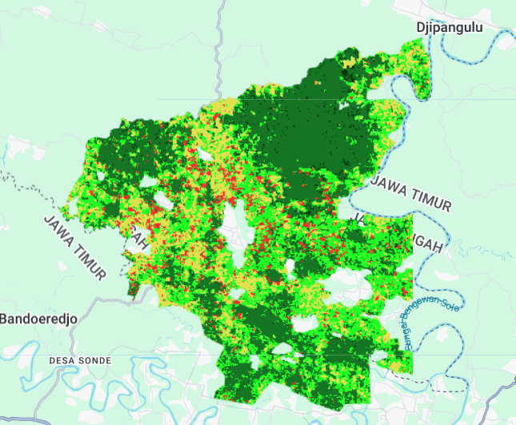

# Land Cover Classification using Google Earth Engine

## Project Description
This project demonstrates automated land cover classification using Google Earth Engine and machine learning algorithms for environmental monitoring and forestry applications.

## Script Features
- Cloud masking and image preprocessing
- Random Forest classification algorithm
- Accuracy assessment with confusion matrix
- Export results to Google Drive

## Technologies Used
- Google Earth Engine (JavaScript API)
- Landsat 8/9 Satellite Imagery
- Machine Learning (Random Forest Classifier)

## How to Use
1. Copy the code from `land_cover_classification.js`
2. Paste into Google Earth Engine Code Editor
3. Adjust the Area of Interest (AOI) as needed
4. Run the script and check console for accuracy results

## Results
- Overall Accuracy: [Your Accuracy]%
- Kappa Coefficient: [Your Kappa Score]

## Sample Output

## Author
Hilmi Nur Persada - Final Year Forestry Student at Universitas Gadjah Mada
- Email: hilmi.nur.persada@mail.ugm.ac.id
- LinkedIn: [Your LinkedIn Profile]

## License
MIT License - feel free to use and modify for educational purposes.
